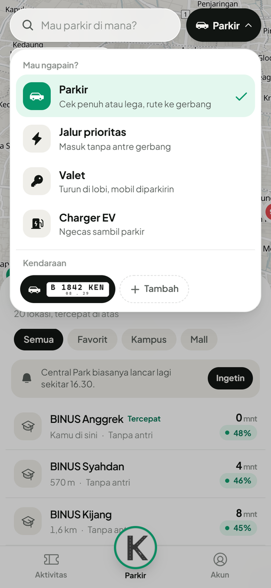
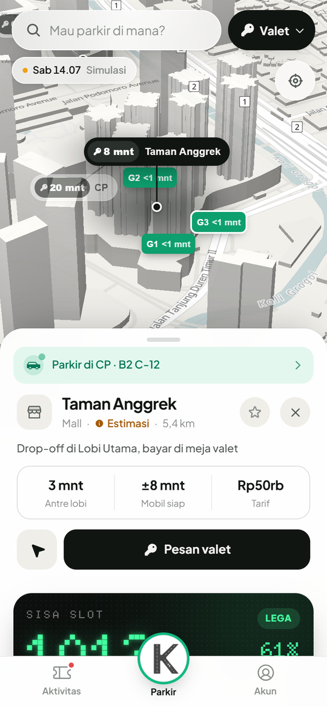
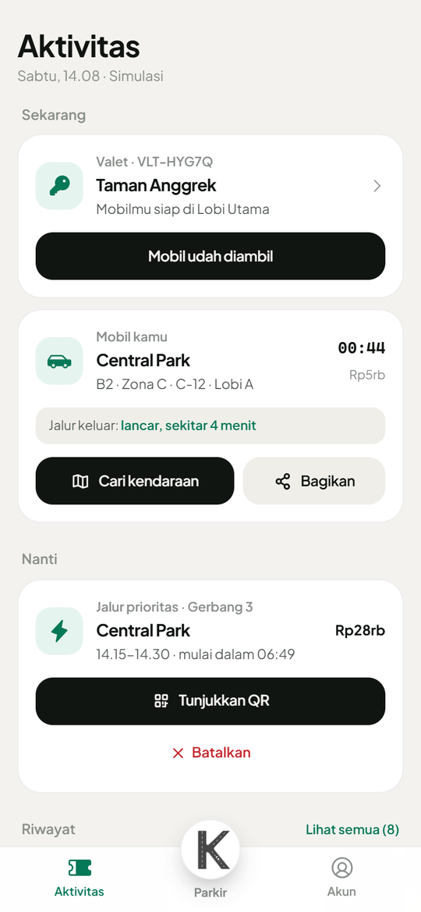
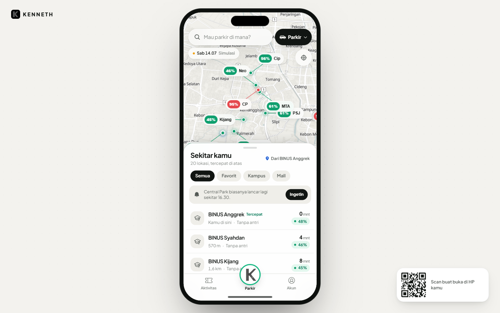

<p align="center">
  
</p>

<h1 align="center">KENNETH</h1>

<p align="center"><b>Cek parkir semudah cek cuaca.</b><br/>
Seberapa penuh, antri gerbang berapa menit, dan ke mana kalau penuh. Sebelum kamu berangkat.</p>

<p align="center"><a href="https://kenneth-park.web.app"><b>kenneth-park.web.app</b></a><br/>
Buka di HP untuk app-nya. Di laptop, app yang sama tampil di bingkai HP dengan QR di pojok.</p>

<p align="center">
  
  
  
  
</p>

> **Status: prototipe.** Dibuat untuk mata kuliah ENPR6312 Venture Creation (BINUS, semester ganjil 2026/2027).
> Semua angka okupansi, antrian, dan tarif di app ini **disimulasikan**. Belum ada pengelola gedung yang terhubung,
> dan app menyebut itu di setiap halaman lokasi.

*English summary: KENNETH is a mobile web app that shows how full Jakarta car parks (malls and the BINUS campuses)
are before you leave home, how long the gate queue is, and which nearby place still has space. It books a bay in
the KENNETH Zone (reserved bays by the lobby, like brand-only parking), a KENNETH runner valet and EV chargers. This repo is a working prototype with simulated data, built for a
university venture course.*

---

## Masalahnya

Di Jakarta, akhir pekan, muter 20 sampai 30 menit nyari parkir itu biasa. Yang bikin kesel, sering ada mall lain
5 menit dari situ yang masih lega, dan nggak ada yang ngasih tahu. Hari kerja ceritanya pindah ke kampus: gedung parkir
BINUS penuh dari kelas pagi, padahal kampus sebelahnya masih ada tempat. Google Maps nganter sampai pintu gedung lalu
berhenti. App operator parkir baru kepakai setelah kamu masuk. Padahal keputusan paling berharga terjadi sebelum berangkat.

**Google Maps berhenti di pintu gedung. KENNETH mulai dari situ.**

## Cara pakainya

App-nya cuma tiga tab, selalu di tempat yang sama di bawah layar. Logo K di tengah adalah rumahnya, dibuat lebih
menonjol seperti tombol QRIS di app bank. Nggak ada dashboard, dan app nggak pernah pindah tab sendiri.

| Tab | Isi |
|---|---|
| **Aktivitas** (kiri) | Tiga bagian. Sekarang: lokasi parkirmu, runner valet yang lagi jalan, petak Zona KENNETH yang sedang ditahan. Nanti: booking yang belum mulai dan pengingat. Riwayat: yang sudah selesai, dibatalkan, atau hangus, masing-masing dengan tombol "Lagi" untuk pesan ulang sekali tap |
| **Parkir** (logo K, tengah) | Peta besar, search, dan dropdown "Mau ngapain?" di kanan search: Parkir, Zona KENNETH, Valet runner, Charger EV, plus pilihan kendaraan (mobil atau motor). Layoutnya selalu sama, yang berubah cuma angka di pin dan satu tombol utama di kartu tempat. Tap K lagi untuk balik ke tampilan awal |
| **Akun** (kanan) | Masuk dengan Google atau tetap jadi tamu, kendaraan, paket, dampak bulan ini, opsi peta, notifikasi |

Tiap booking yang masih bisa dibatalkan punya tombol "Batalkan" yang kelihatan, di kartu Aktivitas, di tiketnya, dan
langsung setelah memesan. Batalnya dua langkah dengan aturannya ditulis. Yang dibatalkan tetap tercatat di Riwayat.
Kalau ada yang lagi jalan (misalnya runner sedang membawa mobil balik), satu baris muncul di atas kartu tab Parkir.

Pertama kali dibuka ada onboarding empat langkah (bisa dilewati): sambutan, yang bisa dibantu, tempat favorit,
kendaraan. Setelah itu langsung ke peta.

Halaman lain:

| Halaman | Isi |
|---|---|
| `/mitra` | Dashboard untuk pengelola gedung (produk B2B): pengunjung yang batal datang, larinya ke mana, beban tiap gerbang, pola seminggu |
| `/booth` | Mode booth BINUS Festival: form validasi + feedback grid, hasilnya bisa diunduh CSV atau JSON |

Keduanya ada di Akun, bagian "Untuk tim dan demo". Untuk demo, jam app diset ke **Sabtu 14.07** (mall puncak).
Ganti lewat chip jam di kiri atas peta. **Selasa 10.00** memperlihatkan kampus yang penuh.

## Lokasi

20 lokasi, sengaja dipadatkan di sekitar tiap kampus BINUS (keputusan tim: kepadatan cakupan lebih penting dari luas):

| Area | Kampus | Mall |
|---|---|---|
| Kemanggisan, Tanjung Duren | BINUS Anggrek, Syahdan, Kijang | Central Park, Neo Soho, Taman Anggrek, Mal Ciputra, Plaza Slipi Jaya |
| Puri | | Lippo Mall Puri, Puri Indah Mall |
| Senayan, Thamrin | BINUS Senayan | Senayan City, Plaza Senayan, fX Sudirman, Grand Indonesia |
| Alam Sutera | BINUS Alam Sutera | Mall @ Alam Sutera, Living World |
| Bekasi | BINUS Bekasi | Summarecon Mall Bekasi |

Kampus punya kurva sendiri (penuh dari kelas pagi di hari kerja, sepi hari Minggu) dan jam buka 06.00 sampai 21.00.
Kalau satu kampus penuh, alternatifnya kampus lain atau tempat yang bisa dijalan kaki, bukan mall di seberang kota.
Motor dan mobil punya slot, tingkat keterisian, dan tarif sendiri: ganti kendaraan di Akun, semua angka ikut berubah.

## Fitur, dipetakan ke 11 fitur di dokumen strategi

| # | Fitur | Di mana |
|---|---|---|
| 01 | Kondisi parkir real-time | Pin dan daftar di tab Parkir, papan "SISA SLOT" di detail lokasi |
| 02 | Rekomendasi alternatif | Detail lokasi yang penuh, bagian "Masih lega di dekat sini" |
| 03 | Ingetin saat lega | Tombol ⋯ di kartu tempat, baris pengingat di daftar, pengingat aktif di Aktivitas |
| 04 | Estimasi biaya parkir | Detail lokasi, baris "Biaya parkir" |
| 05 | Arahkan ke gerbang yang bener | Chip antrian tiap gerbang di peta, tombol Rute ke gerbang paling lancar (di KENNETH, Google Maps, atau Waze) |
| 06 | Inget lokasi mobil | Tombol ⋯ lalu "Simpan lokasi parkir", atau "Udah sampai" di akhir rute. Muncul di Aktivitas dan di baris atas tab Parkir |
| 07 | Rute mobil ke tenant | Detail lokasi, "Dari parkir ke tujuan", plus denah basement 3D di "Cari kendaraan" |
| 08 | Slot difabel dan ibu hamil | Detail lokasi, baris "Slot khusus" |
| 09 | Booking petak Zona KENNETH | Mode Zona KENNETH, atau saran "Males muter?" di kartu tempat yang ramai. Tiket petak (nomor petak plus QR cadangan) di Aktivitas |
| 10 | Booking charger EV | Mode Charger EV, pin menunjukkan charger yang kosong |
| 11 | Pola kebiasaan pribadi | Akun, Dampak bulan ini, "Pola kebiasaanmu" (Premium) |

Tambahan di luar 11 fitur:

- **Valet runner.** Runner KENNETH nunggu di lobi, nyocokin kode booking sama pelat, lalu parkir mobilnya di Zona KENNETH.
  Tekan "Siapkan mobil" sebelum turun ke lobi, ada hitung mundur dan notifikasi "Mobilmu siap di Lobi A". Bayar di app.
- **Opsi peta.** Tampilan Tenang atau Detail, gedung 3D nyala atau mati, dan tombol Rute bisa langsung membuka
  Google Maps atau Waze dengan tujuan gerbang paling lancar.
- **Akun Google** lewat Firebase Authentication. Mode tamu tetap bisa semua fitur.
- Scrubber jam ala ramalan cuaca, lapor kondisi ala Waze, cek ganjil-genap, laporan dampak bulanan dengan rumus terbuka,
  pusat privasi, mode gelap, bahasa Indonesia dan Inggris, bisa di-install sebagai app (PWA).

## Keputusan produk yang kelihatan di app

- **Zona KENNETH, kayak parkir khusus Lexus.** Gedung menyisihkan 12 sampai 40 petak dekat lobi khusus pengguna KENNETH.
  Booking jam datang, petak ditahan 30 menit, palang baca pelat, lalu parkir selama apa pun dengan tarif gedung biasa.
  Ini ide, belum realistis untuk sekarang. Lihat [docs/PRODUCT.md](docs/PRODUCT.md).
- **Booking bayar per pakai.** Premium cuma jual hal yang nggak pernah habis: booking lebih awal, diskon, notifikasi.
- **Valet pakai armada runner KENNETH.** Mobil diparkir di Zona KENNETH, jadi baliknya cepat. Nol biometrik, cukup kode dan pelat.
- **Kampus tidak menjual apa pun.** Di kampus app cuma menunjukkan seberapa penuh dan ke mana kalau penuh.
- **Jujur soal sumber data.** Tiap lokasi berlabel "Data palang" atau "Estimasi".
- **Data pribadi tinggal di HP.** Login Google hanya mengirim nama, email, dan foto profil. Riwayat, booking, dan lokasi
  parkir tetap di perangkat. Yang nantinya dijual ke pengelola hanya agregat per jam.

## Jalankan sendiri

Butuh Node.js 20.19 atau lebih baru.

```bash
npm install
npm run dev
```

Buka `http://localhost:5173`. Tanpa konfigurasi apa pun app jalan dalam mode tamu. Untuk mengaktifkan tombol
"Masuk dengan Google", salin `.env.example` jadi `.env.local` lalu isi nilainya (cara ambilnya tertulis di file itu).

```bash
npm test          # unit test mesin simulasi (vitest)
npm run build     # build produksi ke dist/
npm run preview   # jalankan hasil build
npm run lint      # oxlint
```

## Deploy ke Firebase Hosting

Konfigurasi ada di [firebase.json](firebase.json): semua rute diarahkan ke `index.html` (app satu halaman),
file di `assets/` di-cache setahun karena namanya selalu berubah tiap build, sedangkan semua rute, `index.html`,
dan service worker selalu dicek ulang supaya versi baru langsung sampai. Paket gratis (Spark) sudah cukup.

Folder ini sudah terhubung ke project `kenneth-9339d` lewat [.firebaserc](.firebaserc). Yang mau rilis harus
ditambahkan dulu sebagai anggota project di Firebase console, lalu login sekali:

```bash
npx firebase-tools login
```

Setelah itu setiap mau rilis:

```bash
npm run deploy           # build lalu publish ke https://kenneth-9339d.web.app
npm run deploy:preview   # link uji coba terpisah, hangus sendiri setelah 7 hari
```

Login Google perlu diaktifkan sekali oleh pemilik project: Firebase console, Authentication, Get started,
Sign-in method, Google, Enable, pilih email dukungan, Save. Tidak perlu deploy ulang setelahnya.

## Stack

React 19, TypeScript, Vite, Tailwind CSS 4, Motion untuk animasi, MapLibre GL dengan peta
[OpenFreeMap](https://openfreemap.org) (data OpenStreetMap, gratis tanpa API key), rute dari server demo
[OSRM](https://project-osrm.org), three.js untuk denah basement 3D, Zustand untuk state yang disimpan di perangkat,
Firebase Authentication untuk login Google (dimuat hanya saat tombolnya ditekan), vite-plugin-pwa.
Font: Plus Jakarta Sans (dibuat untuk identitas kota Jakarta) dan Doto untuk angka ala papan LED parkir.

## Struktur

```
src/
  data/        daftar lokasi (koordinat dan gerbang dari OSM, sisanya data demo)
  engine/      mesin simulasi: okupansi, antrian gerbang, harga, Zona KENNETH, valet runner, ganjil-genap, dampak, ranking, angka mitra
  store/       state app (disimpan di localStorage), state UI, jam simulasi, jawaban booth
  i18n/        teks Indonesia dan Inggris
  components/  UI per layar: explore (tab Parkir), activity, account, sheets (termasuk sheets/book), onboarding, map, park (3D)
  lib/         login Google, navigasi ke app lain, notifikasi, waktu WIB
  pages/       /mitra dan /booth
docs/          dokumen produk, model simulasi, screenshot, logo (docs/brand)
```

## Logo dan layar pembuka

Logonya huruf K yang tersusun dari jalan dilihat dari atas, dengan satu mobil di cabang bawah. Batangnya
jalan yang sedang kamu lewati, dua cabangnya pilihan tempat, dan mobilnya mengambil yang lega.
File asli dan versi 1024px ada di [docs/brand](docs/brand).

Saat app dibuka muncul layar hitam dengan logo. Selama app memuat, mobilnya diam di tempat parkirnya. Begitu
peta selesai digambar, mobil itu jalan ke persimpangan, belok kanan, lalu keluar lewat cabang atas sementara layar
pembuka memudar. Mobil sengaja menunggu peta karena pembuatan peta sempat menahan browser, jadi kalau jalan lebih
awal gerakannya bisa patah. Paling lambat 3,2 detik setelah halaman dibuka mobil tetap jalan. Pengguna yang
mematikan animasi langsung masuk tanpa klip.

Gerakan mobil mengikuti klip hasil generate AI, tapi setiap piksel mobil dan jalan diambil dari logo asli, jadi
bentuknya tidak pernah berubah. Klipnya ada di `public/brand/` (MP4, WebM, dan poster frame pertama), begitu juga
loop 6 detik versi kecil yang dipakai di layar sambutan onboarding. Versi loop untuk booth dan media sosial (1:1, 9:16,
16:9) ada di [docs/brand](docs/brand).

Cara kerja simulasinya dijelaskan di [docs/MODEL.md](docs/MODEL.md). Panduan buat anggota tim ada di
[CONTRIBUTING.md](CONTRIBUTING.md).

## Data dan atribusi

- Peta: © OpenStreetMap contributors, disajikan oleh OpenFreeMap.
- Rute: OSRM demo server, dipakai sewajarnya untuk prototipe. Kalau server lambat, app jatuh ke rute perkiraan.
- Koordinat mall dan kampus dari Nominatim (OpenStreetMap). Posisi gerbang lokasi yang ditambahkan 19 Sep 2026 diambil
  dari pintu parkir dan jalan servis yang tercatat di OSM. Kapasitas, tarif, tarif valet, jumlah charger, dan lantai
  tenant adalah **data demo** dan belum dikonfirmasi ke pengelola.
- Nama mall dan kampus dipakai hanya sebagai contoh lokasi. Tidak ada kerja sama atau afiliasi dengan pengelola mana pun.

<p align="center">
  
</p>
