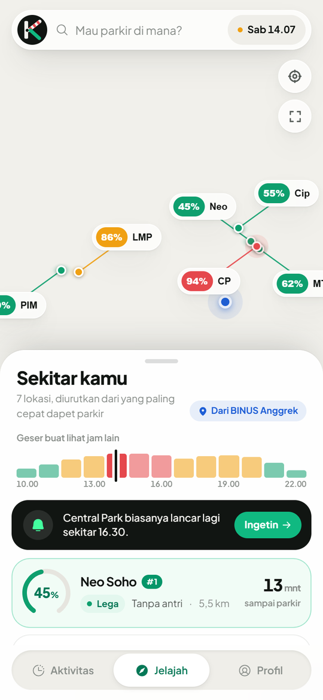
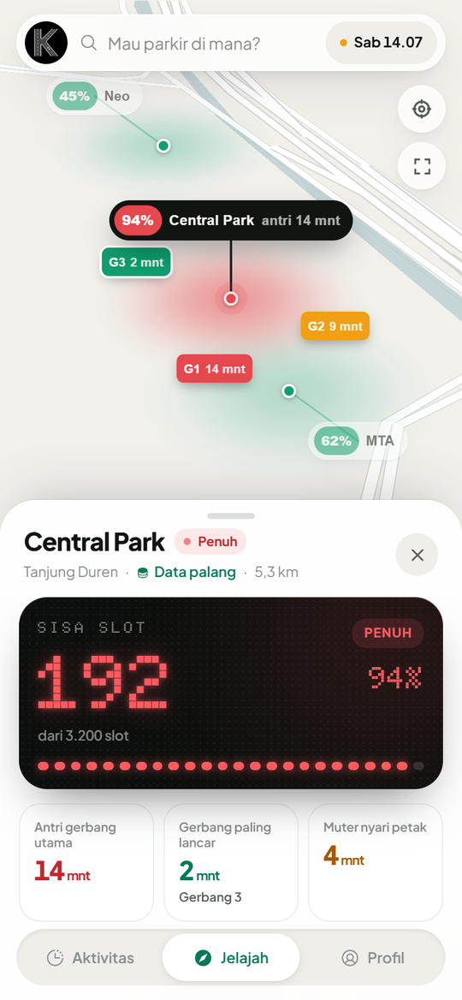
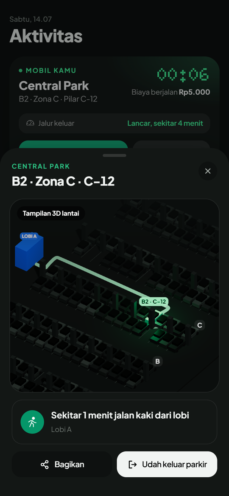
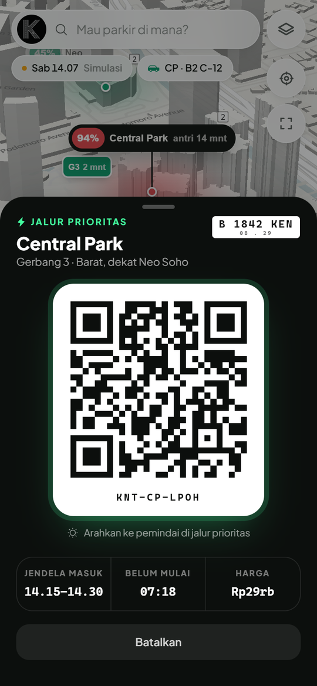
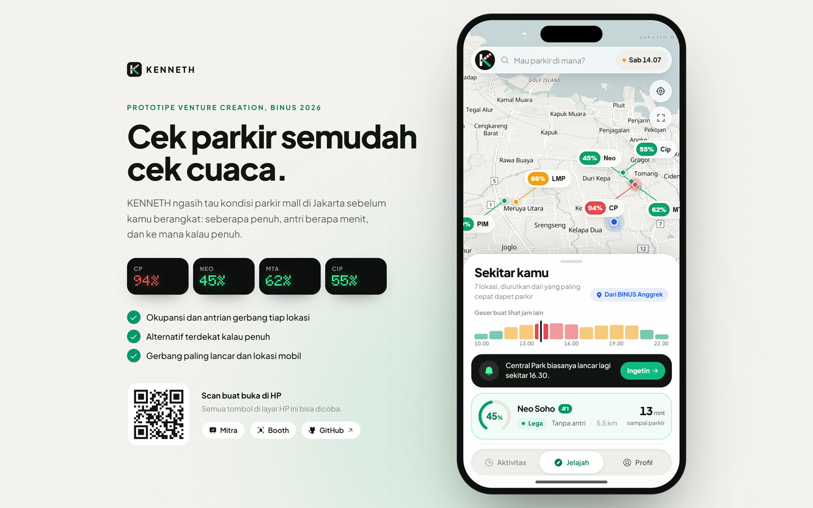

<p align="center">
  
</p>

<h1 align="center">KENNETH</h1>

<p align="center"><b>Cek parkir semudah cek cuaca.</b><br/>
Seberapa penuh, antri gerbang berapa menit, dan ke mana kalau penuh. Sebelum kamu berangkat.</p>

<p align="center">
  
  
  
  
</p>

> **Status: prototipe.** Dibuat untuk mata kuliah ENPR6312 Venture Creation (BINUS, semester ganjil 2026/2027).
> Semua angka okupansi, antrian, dan tarif di app ini **disimulasikan**. Belum ada pengelola gedung yang terhubung,
> dan app menyebut itu di setiap halaman lokasi.

*English summary: KENNETH is a mobile web app that shows how full Jakarta mall car parks are before you leave home,
how long the gate queue is, and which nearby mall still has space. This repo is a working prototype with simulated data,
built for a university venture course.*

---

## Masalahnya

Di Jakarta, akhir pekan, muter 20 sampai 30 menit nyari parkir itu biasa. Yang bikin kesel, sering ada mall lain
5 menit dari situ yang masih lega, dan nggak ada yang ngasih tahu. Google Maps nganter sampai pintu gedung lalu berhenti.
App operator parkir baru kepakai setelah kamu masuk. Padahal keputusan paling berharga terjadi sebelum berangkat.

**Google Maps berhenti di pintu gedung. KENNETH mulai dari situ.**

## Yang bisa dicoba

| Halaman | Isi |
|---|---|
| `/` | App utama. Di HP tampil penuh, di laptop tampil sebagai showcase dengan HP yang bisa diklik dan QR buat dibuka di HP |
| `/mitra` | Dashboard untuk pengelola gedung (produk B2B): pengunjung yang batal datang, larinya ke mana, beban tiap gerbang, pola seminggu |
| `/booth` | Mode booth BINUS Festival: form validasi + feedback grid, hasilnya bisa diunduh CSV atau JSON |

Untuk demo, jam app diset ke **Sabtu 14.07** (skenario puncak). Ganti lewat chip jam di pojok kanan atas atau
Profil, Mode demo, Waktu simulasi.

## Fitur, dipetakan ke 11 fitur di dokumen strategi

| # | Fitur | Di mana |
|---|---|---|
| 01 | Kondisi parkir real-time | Pin dan daftar di Jelajah, papan "SISA SLOT" di detail lokasi |
| 02 | Rekomendasi alternatif | Detail lokasi yang penuh, bagian "Masih lega di dekat sini" |
| 03 | Ingetin saat lega | Kartu "biasanya lancar lagi sekitar..." di Jelajah dan detail |
| 04 | Estimasi biaya parkir | Detail lokasi, pengatur jam |
| 05 | Arahkan ke gerbang yang bener | Chip antrian tiap gerbang di peta, rute otomatis ke gerbang paling lancar |
| 06 | Inget lokasi mobil | "Udah sampai" atau "Parkir di sini", simpan lantai, zona, pilar, lobi, foto |
| 07 | Rute mobil ke tenant | Detail lokasi, "Dari parkir ke tujuan", plus denah basement 3D di "Cari mobil" |
| 08 | Slot difabel dan ibu hamil | Detail lokasi, bagian "Slot khusus" |
| 09 | Booking jalur prioritas | Tombol "Jalur prioritas" saat antrian panjang, tiket QR di Aktivitas |
| 10 | Booking charger EV | Detail lokasi, bagian "Charger mobil listrik" |
| 11 | Pola kebiasaan pribadi | Aktivitas, kartu "Pola kebiasaanmu" (Premium) |

Tambahan di luar 11 fitur: scrubber jam ala ramalan cuaca (geser, seluruh peta ikut berubah), lapor kondisi ala Waze,
cek ganjil-genap (mobil listrik bebas), laporan dampak bulanan dengan rumus terbuka, pusat privasi, mode gelap untuk nyetir malam,
bahasa Indonesia dan Inggris, bisa di-install sebagai app (PWA).

## Keputusan produk yang kelihatan di app

- **Tidak jual petak, jual giliran masuk.** Tiket prioritas berlaku 15 menit untuk lewat jalur khusus. Setelah masuk,
  parkir biasa tanpa batas waktu dan tanpa denda. Lihat [docs/PRODUCT.md](docs/PRODUCT.md) untuk alasannya.
- **Booking bayar per pakai.** Premium cuma jual hal yang nggak pernah habis: booking lebih awal, diskon, notifikasi.
- **Jual 24 dari 30 giliran per jendela.** Sisanya bantalan buat yang telat.
- **Jalur prioritas cuma ditawarkan kalau antrian nyata** (5 menit ke atas). Kalau sepi, app bilang nggak perlu.
- **Jujur soal sumber data.** Tiap lokasi berlabel "Data palang" atau "Estimasi".
- **Data pribadi tinggal di HP.** Prototipe ini tidak punya server. Yang nantinya dijual ke pengelola hanya agregat per jam.

## Jalankan sendiri

Butuh Node.js 20.19 atau lebih baru.

```bash
npm install
npm run dev
```

Buka `http://localhost:5173`. Perintah lain:

```bash
npm test          # unit test mesin simulasi (vitest)
npm run build     # build produksi ke dist/
npm run preview   # jalankan hasil build
npm run lint      # oxlint
```

## Deploy ke Firebase Hosting

Konfigurasi ada di [firebase.json](firebase.json): semua rute diarahkan ke `index.html` (app satu halaman),
file di `assets/` di-cache setahun karena namanya selalu berubah tiap build, sedangkan `index.html` dan
service worker selalu dicek ulang supaya versi baru langsung sampai. Paket gratis (Spark) sudah cukup.

Sekali saja, untuk menghubungkan folder ini ke project Firebase:

```bash
npx firebase-tools login
npx firebase-tools use --add
```

Setelah itu setiap mau rilis:

```bash
npm run deploy           # build lalu publish ke https://<project-id>.web.app
npm run deploy:preview   # link uji coba terpisah, hangus sendiri setelah 7 hari
```

## Stack

React 19, TypeScript, Vite, Tailwind CSS 4, Motion untuk animasi, MapLibre GL dengan peta
[OpenFreeMap](https://openfreemap.org) (data OpenStreetMap, gratis tanpa API key), rute dari server demo
[OSRM](https://project-osrm.org), three.js untuk denah basement 3D, Zustand untuk state yang disimpan di perangkat,
vite-plugin-pwa. Font: Plus Jakarta Sans (dibuat untuk identitas kota Jakarta) dan Doto untuk angka ala papan LED parkir.

## Struktur

```
src/
  data/        daftar lokasi (koordinat asli OSM, sisanya data demo)
  engine/      mesin simulasi: okupansi, antrian gerbang, harga, ganjil-genap, dampak, ranking, angka mitra
  store/       state app (disimpan di localStorage), state UI, jam simulasi, jawaban booth
  i18n/        teks Indonesia dan Inggris
  components/  UI per layar: explore, sheets, activity, profile, onboarding, map, park (3D), charts
  pages/       /mitra dan /booth
docs/          dokumen produk, model simulasi, screenshot, logo (docs/brand)
```

## Logo dan layar pembuka

Logonya huruf K yang tersusun dari jalan dilihat dari atas, dengan satu mobil di cabang bawah. Batangnya
jalan yang sedang kamu lewati, dua cabangnya pilihan tempat, dan mobilnya mengambil yang lega.
File asli dan versi 1024px ada di [docs/brand](docs/brand).

Saat app dibuka muncul layar hitam dengan logo dan marka jalan yang bergerak. Kalau ada video animasi logo,
taruh `public/brand/loading.mp4` (boleh ditambah `loading.webm` dan `loading-poster.jpg` berisi frame pertama),
lalu build ulang. Video otomatis dipakai tanpa ubah kode, dan dilewati untuk pengguna yang mematikan animasi.

Cara kerja simulasinya dijelaskan di [docs/MODEL.md](docs/MODEL.md). Panduan buat anggota tim ada di
[CONTRIBUTING.md](CONTRIBUTING.md).

## Data dan atribusi

- Peta: © OpenStreetMap contributors, disajikan oleh OpenFreeMap.
- Rute: OSRM demo server, dipakai sewajarnya untuk prototipe. Kalau server lambat, app jatuh ke rute perkiraan.
- Koordinat mall dari Nominatim (OpenStreetMap). Kapasitas, gerbang, tarif, jumlah charger, dan lantai tenant adalah
  **data demo** dan belum dikonfirmasi ke pengelola.
- Nama mall dipakai hanya sebagai contoh lokasi. Tidak ada kerja sama atau afiliasi dengan pengelola mana pun.

<p align="center">
  
</p>
