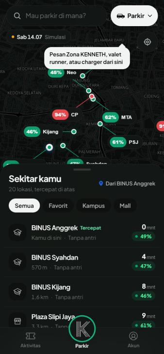
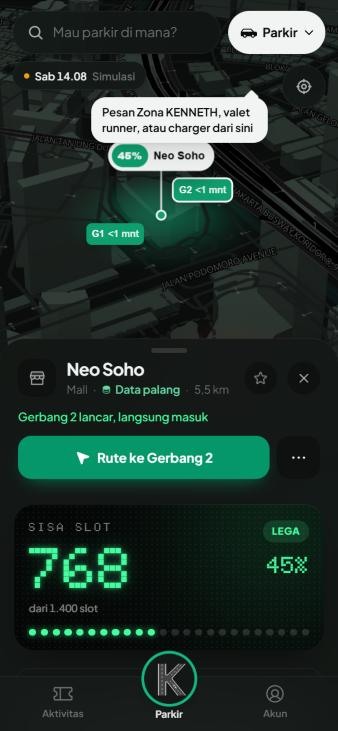
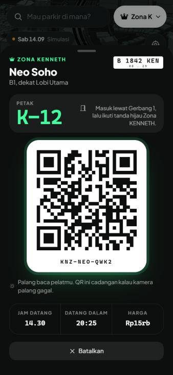
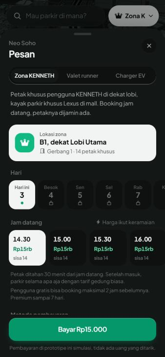

# Audit UI: dibandingkan cara Apple bikin app

Dicek 2 Okt 2026 di `main` (`3c87868`), lebar HP 375 px, mode gelap, sebagai pengguna baru dari onboarding
sampai pesan petak di Neo Soho. Latar belakangnya masukan presentasi: UI bikin pusing dan butuh waktu buat paham
(lihat [STATUS.md](STATUS.md) bagian 9).

Patokannya cara app bawaan iPhone dibuat: orang yang baru pertama kali buka langsung tahu harus menekan apa,
tanpa tip dan tanpa harus membaca dulu. Prinsip yang dipakai:

1. **Yang utama kelihatan.** Fitur inti tidak boleh butuh tip untuk ditemukan.
2. **Tiap angka punya label.** Orang tidak perlu menebak arti angka.
3. **Satu tugas, satu jalan.** Tidak ada dua cara berbeda untuk hal yang sama.
4. **Tampilkan sedikit dulu, sisanya kalau diminta.** Detail baru muncul saat dibuka.
5. **Minta data saat dibutuhkan,** bukan di depan.
6. **Pakai kata yang orang sudah tahu,** bukan istilah internal tim.

Screenshot ada di [screens/audit](screens/audit).

## Temuan besar

### 1. Layanan berbayar tersembunyi di pojok kanan atas

Zona KENNETH, valet runner, dan charger EV hanya bisa dicapai dari tombol "Parkir" di kanan atas. Tombol itu
kelihatan seperti filter, jadi app perlu tip "Pesan Zona KENNETH, valet runner, atau charger dari sini" supaya
orang tahu. Kalau fitur inti butuh tip, letaknya yang salah.

Masalah turunannya:
- Di kartu lokasi ada baris "Bisa dipesan: Zona KENNETH · Valet runner · Charger EV", tapi itu cuma teks dan
  tidak bisa ditekan. Justru di situ orang paling mungkin mau memesan.
- Ada dua cara memilih layanan: dropdown "Mau ngapain?" di peta dan tab Zona/Valet/Charger di layar Pesan.
- Selama tip masih tampil, tekanan pertama ke tombol itu hanya menutup tip. Menunya baru terbuka di tekanan kedua.

**Usulan:** di kartu lokasi, taruh deretan tombol aksi seperti Apple Maps: Rute, Pesan petak, Pesan runner,
Pesan charger (yang tidak tersedia di lokasi itu tidak muncul). Dropdown di peta dihapus, atau diturunkan jadi
filter peta biasa. Ini mengubah keputusan produk no. 9 ("satu layar untuk semua layanan"), jadi perlu
persetujuan tim dulu.

### 2. Angka tanpa label, dan artinya berubah per mode

- Tiap baris daftar punya dua angka: angka besar "13 mnt" dan angka kecil "45%". Tidak ada yang bilang "13 mnt"
  itu waktu sampai dapat petak (perjalanan plus antri).
- Angka di pin peta berubah arti tergantung mode: persen terisi, harga, menit mobil balik, atau jumlah charger.
  Pengguna harus ingat sedang di mode apa untuk membaca peta.

**Usulan:** tulis artinya di sebelah angka ("Lega, 45% terisi", "13 mnt sampai parkir"). Pin peta selalu
menunjukkan satu hal yang sama (status lega/ramai/penuh). Harga dan menit runner cukup di kartu lokasi.

### 3. Singkatan di peta

Pin memakai singkatan seperti CP, MTA, PSJ, SenCi, LMP, M@AS. Tim tahu artinya, pengguna baru tidak.

**Usulan:** nama lengkap saat peta diperbesar. Saat diperkecil cukup titik berwarna tanpa teks, seperti Apple Maps.

### 4. Onboarding panjang dan minta data di depan

Empat layar sebelum melihat peta: pembuka, penjelasan fitur, pilih lokasi favorit dari 20 nama, lalu isi pelat,
model, nama panggilan, dan mobil listrik. Layar kedua juga sempat kosong sekitar satu detik sebelum isinya muncul.

**Usulan:** satu layar pembuka lalu langsung ke peta. Pelat ditanya saat pertama kali memesan petak, karena baru di
situ pelat dibutuhkan. Favorit cukup lewat tombol bintang di kartu lokasi, yang sudah ada.

## Temuan sedang

### 5. Kartu detail lokasi terlalu padat

Setelah tombol utama, ada sembilan bagian berturut-turut: papan sisa slot, grafik perkiraan, gerbang, biaya
parkir, layanan, slot khusus, rute ke tenant, lapor kondisi, dan catatan simulasi.

**Usulan:** yang langsung tampil cukup status, gerbang yang disarankan, dan tombol aksi. Sisanya masuk ke satu
baris "Detail lokasi" yang bisa dibuka.

### 6. "Datang dalam 20:25" terbaca seperti jam

Di tiket dan di tab Aktivitas, hitung mundur ditulis "20:25". Di sebelahnya ada jam datang "14.30", jadi "20:25"
mudah terbaca sebagai jam 20.25.

**Usulan:** "20 mnt lagi". Detiknya tidak perlu.

### 7. Istilah internal dan alat demo di layar utama

- Chip "Sab 14.07 Simulasi" selalu tampil di peta. Itu alat demo, bukan untuk pengguna.
- "Data palang" di bawah nama lokasi: pengguna tidak tahu bedanya dengan "Estimasi".
- Tombol mode terpotong jadi "Zona K".
- Teks mencampur "booking" dan "pesan" ("Booking jam datang", "Pengguna gratis bisa booking"), padahal nama yang
  disepakati "pesanan".

**Usulan:** jam simulasi pindah ke Akun, bagian "Untuk tim dan demo", dan di peta cukup label kecil "Demo".
"Data palang" diganti "Data langsung". Semua "booking" di layar diganti "pesan" atau "pesanan".

## Temuan kecil

- Di mode Zona, tombol Rute mengecil jadi ikon panah tanpa tulisan. Sebaiknya tetap bertulisan "Rute".
- Logo K di tengah tab bar menutupi baris daftar di belakangnya (contoh: baris Plaza Slipi Jaya).
- Pengguna baru langsung melihat riwayat contoh "Bulan ini 8 kali parkir". Bagus untuk demo, membingungkan untuk
  orang baru. Beri label "Contoh" atau tampilkan hanya di mode demo.

## Yang sudah bagus, jangan diubah

- Layar pesan petak: lokasi zona, pilihan hari, jam datang dengan harga dan sisa petak per jam, satu tombol bayar.
- Tiket petak: nomor petak besar (K-12), gerbang masuk, "ikuti tanda hijau", QR cadangan, dan catatan bahwa palang
  membaca pelat. Ini sudah menjawab pertanyaan "langsung ditunjukkan petaknya atau harus cari lagi?".
- Setelah bayar, hasilnya tetap di layar dengan pilihan buka tiket atau batalkan, dan app tidak pindah tab sendiri.
- Tab Akun sudah memakai pola daftar berkelompok seperti Pengaturan di iPhone. Pilihan tema (Ikut sistem, Terang,
  Gelap) juga sudah ada, tinggal ditambah warna aksen.

## Urutan pengerjaan yang disarankan

| Urutan | Perubahan | Temuan | Butuh keputusan tim? |
|---|---|---|---|
| 1 | Tombol aksi layanan di kartu lokasi, dropdown mode dihapus atau jadi filter | 1, 2 | Ya, mengubah keputusan no. 9 |
| 2 | Label di tiap angka, pin peta selalu status, nama lengkap di pin | 2, 3 | Tidak |
| 3 | Onboarding satu layar, pelat ditanya saat pesan pertama | 4 | Tidak |
| 4 | Kartu lokasi ringkas dengan "Detail lokasi" | 5 | Tidak |
| 5 | Perbaikan teks: hitung mundur, istilah, jam simulasi, tulisan di tombol Rute | 6, 7 | Tidak |
| 6 | Warna aksen di Akun | masukan Delon | Tidak |
