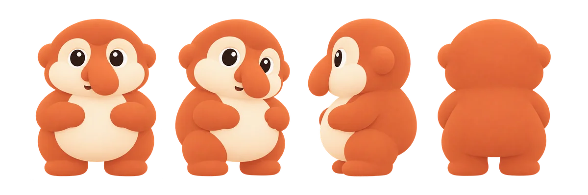

# Maskot: bekantan

Maskot KENNETH adalah bekantan, monyet berhidung besar khas Kalimantan. Hidungnya jadi cerita produknya: hidung buat
nyium parkir yang masih lega. Bentuknya sengaja sangat sederhana (beberapa bentuk bulat besar, dua warna: oranye karat
dan krem) supaya tetap terbaca di 32 px, dan beda jelas dari maskot bekantan Dufan: tanpa baju, tanpa topi.



## Cara dibuat (7 Okt 2026)

1. Skill `ip-as-logo` mengusulkan tiga arah (kucing, gajah, penguin), lalu pemilik memilih bekantan. Tiga perlakuan
   bekantan (hidung paling depan, perut buncit, kepala besar bermata lebar), masing-masing dua kandidat dari pojok
   kiri bawah dan kanan bawah. Semua digambar GPT Image 2.5 lewat Codex, sekali gambar tanpa diulang.
2. Pemilik suka mata kandidat C1 dan perut kandidat B, jadi empat gabungan D1 sampai D4 dibuat dengan C1 dan B1/B2
   sebagai referensi. Yang dipakai: D3 dan D4, dengan latar cornflower ([reference](reference)).
3. Set lengkap 17 gambar dibuat dengan D3, D4, dan turnaround sebagai referensi. Tiap gambar dicek terhadap
   referensinya dan diulang paling banyak dua kali kalau melenceng. Prompt-nya ada di [prompts](prompts).

File aslinya (PNG 1254 px, latar transparan) disimpan di kit media sosial tim, di luar repo.

## Deskripsi karakter

Dipakai sama persis di semua prompt set:

> a chubby baby proboscis monkey built from a few big soft rounded shapes: a big round warm rust-orange head with two
> small round ears; a soft cream face mask around two big, wide-set, round dark eyes, each with one small white
> highlight; one big soft pear-shaped rust-orange nose hanging over a tiny smiling mouth; a round rust-orange body
> with short chubby arms and legs; and one big round soft cream belly.

## Masuk ke app

```bash
python docs/brand/make_mascot.py <folder set>
```

Skrip memotong tiap pose ke karakternya, membersihkan kabut tipis di tepi hasil generate, lalu menyimpan
`public/mascot/*.webp` (480 px, 164 KB untuk delapan file) dan ukurannya di `src/data/mascot.ts`. Semua file ikut
di-install PWA, jadi tetap muncul saat offline. Untuk memakai pose lain, tambahkan barisnya di `POSES` dalam skrip
lalu jalankan lagi.

Komponennya di `src/components/ui/Mascot.tsx`: `Mascot` (satu pose dengan tinggi tertentu), `MascotPeek` (mengintip
dari tepi atas sebuah kotak, naik sekali saat muncul), dan `MascotFace` (wajah dalam lingkaran untuk toast). Semuanya
dekorasi: teks di sebelahnya yang membawa arti, pembaca layar melewatinya.

## Di mana dia muncul

| Pose | Tempat |
|---|---|
| Mengintip | onboarding (di atas animasi logo), kartu "Belum ada yang berjalan" di Tiket, daftar "Masih lega di dekat sini" |
| Duduk menunggu | tab Tiket yang masih kosong |
| Melihat jauh | pencarian tanpa hasil |
| Berpikir | daftar tempat yang kosong (belum ada favorit, atau tidak ada tempat dengan layanan itu) |
| Melompat senang | layar pesanan selesai (Zona KENNETH, valet runner, charger), banner terima kasih di `/booth` |
| Tertidur | valet atau charger yang sudah tutup untuk hari ini |
| Melambai | `/booth`, di samping pengantar |
| Wajah | toast kabar baik: ada yang batal, mobil valet siap, tempat penuh jadi lega, terima kasih untuk laporan |

Pose yang belum dipakai di app (menunjuk, maaf, kaget, berjalan, memegang HP, jempol, mengintip dari samping,
bergantung dari atas, avatar penuh) disiapkan untuk media sosial dan stiker. File aslinya di kit media sosial.

## Aturan

- Oranye karat itu warna karakter, bukan warna UI. Jangan dipakai sebagai aksen atau status.
- Jangan diberi baju, topi, atau tulisan.
- Paling banyak satu bekantan per layar.
- Untuk pose baru, lampirkan `reference/mark-d3.webp`, `reference/mark-d4.webp`, dan `reference/turnaround.webp`,
  pakai deskripsi karakter di atas, dan cek hasilnya terhadap ketiganya.
