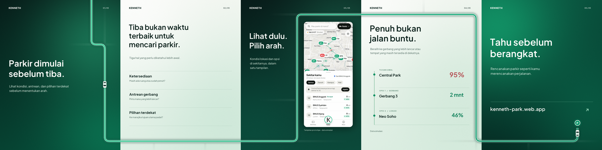
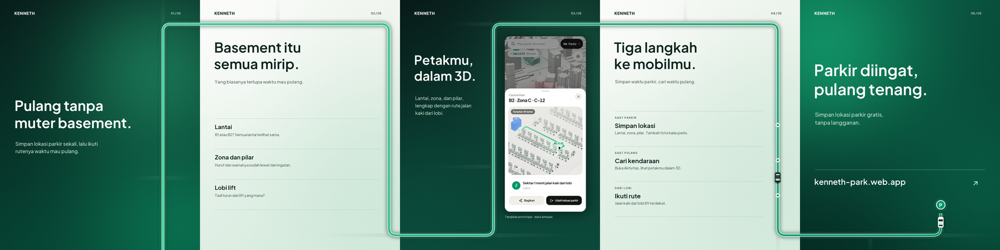

# KENNETH: social media design guide

Guide resmi untuk carousel Instagram KENNETH. Contoh acuannya ada di `examples/`:

| Carousel | Topik | Slide video |
| --- | --- | --- |
| `carousel-01` | Parkir dimulai sebelum tiba (proposisi utama) | 01, latar gelap |
| `carousel-02` | Pulang tanpa muter basement (cari kendaraan) | 04, latar terang, dengan titik langkah |




## Arah visual

**Atmospheric wayfinding:** gradasi forest–emerald dengan sedikit tekstur, satu jalan yang menyambung di seluruh carousel, tipografi besar yang tenang, dan banyak ruang kosong. Tangkapan layar produk hanya muncul sekali per carousel, supaya rangkaian tetap terasa editorial dan bukan brosur fitur.

## Sistem dasar

| Elemen | Aturan |
| --- | --- |
| Format | 1080 × 1350 px (4:5); margin isi ±80 px |
| Latar gelap | Forest `#071B18` → emerald `#064735`, dengan cahaya hijau lembut dan grain ringan |
| Latar terang | Pearl `#F6F8F3` → mint `#DDEEE3` |
| Teks | Plus Jakarta Sans. Judul 62–84 px, weight ±620–650. Teks pendukung 23–29 px, weight 450 |
| Warna teks | Gelap: `#F7FBF7`, pendukung `#CEE6DA`. Terang: `#0F2620`, pendukung `#4A6359`, label kecil `#3E6A56` (lolos WCAG AA; `#577168` lama hanya untuk teks ≥ 24 px) |
| Aksen | Jalan bergaya rute app; pembatas 1 px; merah kusam `#B45155` hanya untuk status padat |
| Header | Wordmark KENNETH di kiri atas (78, 57) dan nomor slide `01 / 05` di kanan atas (923, 61) |
| Struktur | Satu gagasan utama per slide; tanpa label atau footer dekoratif |

Ritme lima slide: **proposisi → masalah → tampilan produk → keputusan → ajakan**. Latar gelap dan terang berselang-seling. Untuk seri berikutnya, gradasi, posisi header, dan tipografi tetap sama. Yang berubah adalah copy, satu visual utama, dan contoh keputusan sesuai topik.

## Jalan sepanjang carousel

Kelima slide diperlakukan sebagai satu panorama 5400 × 1350 px. Jalannya satu garis yang menyambung, jadi saat di-swipe selalu bertemu tepat di tepi slide.

| Elemen | Aturan |
| --- | --- |
| Gaya rute | Sama dengan rute navigasi di app: glow `#059669` (blur), casing putih, inti bergradasi `#34D399` → `#059669` mengikuti progres rute |
| Ukuran (di 1080 px) | Badan jalan 38 px, glow 30, casing 15, inti 9; jalan samping 20 px |
| Badan jalan | Latar gelap: putih-mint ±7%. Latar terang: ink ±6% |
| Belokan | Siku 90° dengan radius 40 px, seperti jalan kota, bukan kurva bebas |
| Jalan samping | Cabang pendek di area kosong yang memudar di ujungnya; tidak boleh menyeberang tepi slide |
| Jalur | Selalu lewat ruang kosong: sisi kanan, pita bawah (y ≈ 1270), celah antar-kolom, atau di atas judul (y ≈ 130). Tidak pernah menimpa teks |
| Tepi slide | Sambungan di tepi slide tidak boleh jatuh di belokan (minimal 20 px dari ujung busur) |
| Mobil | Tampak atas, ±58 × 30 px, bayangan lembut. Di latar gelap: bodi putih, kaca gelap. Di latar terang: bodi ink `#0F2620`, kaca mint. Bergerak di slide video, lalu parkir di slide terakhir |
| Titik langkah | Kalau slide berisi langkah, jalan menjadi timeline: satu titik putih berisi hijau di jalan, sejajar dengan tiap langkah |
| Tujuan | Pin hijau berhuruf **P** di ujung rute, di slide terakhir |

Tiap carousel punya satu `Road(route, streets, waypoints)` di file generatornya sendiri (`source/static/carousel_0N.py`). Slide statis dan video sama-sama membaca dari objek itu.

## Motion

Slide video dipakai sesekali, sebagai satu item di dalam carousel dan bukan iklan terpisah. Slide mana pun boleh jadi video. Contoh:

- `examples/carousel-01/slide-01.mp4`: mobil masuk dari atas, turun mengikuti jalan, lalu keluar lewat kanan menuju slide 02.
- `examples/carousel-02/slide-04.mp4`: mobil masuk dari kiri atas (dari slide 03), turun melewati tiga titik langkah, lalu keluar ke slide 05, tempat mobil terlihat parkir.

| Aturan | Detail |
| --- | --- |
| Format | MP4 1080 × 1350, 30 fps, 5–8 detik (±6 detik, +1 detik bila ada titik langkah), tanpa audio; dibuat dengan Hyperframes |
| Yang bergerak | Hanya mobil. Latar boleh bergeser sangat pelan; teks, jalan, dan wordmark diam |
| Teks | Sudah terlihat sejak frame pertama. Frame pertama juga menjadi thumbnail, jadi harus bisa berdiri sendiri sebagai slide |
| Kecepatan | Stabil di jalan lurus, melambat ±50% di belokan dan ±60% di titik langkah. Tanpa bounce, zoom, blur, atau efek teks |
| Loop | Mobil berada di luar frame pada awal dan akhir, dan gerak latar kembali ke posisi awal, jadi loop di Instagram tidak terasa melompat |
| Arah | Mobil keluar ke arah slide berikutnya, sebagai ajakan untuk swipe |
| Jumlah | Maksimal satu video per carousel. Jalan di video harus sama persis dengan versi statisnya |

## Isi folder

```
GUIDE.md                    guide ini
examples/carousel-0N/       acuan final: slide-01..05.png, video slide, strip, preview
source/static/
  kit.py                    gradasi, tipografi, header, screenshot, save_set()
  road.py                   Road (jalan, gaya rute, titik langkah, pin P) + mobil
  carousel_01.py            copy, layout, dan rute carousel 01
  carousel_02.py            copy, layout, dan rute carousel 02
  fonts/ assets/            Plus Jakarta Sans (+ lisensi OFL), screenshot app
source/motion/carousel-0N/  proyek Hyperframes untuk slide video carousel itu
```

## Cara membuat ulang

Slide statis (butuh `pillow` dan `numpy`):

```bash
cd source/static && python carousel_02.py
```

Hasilnya masuk ke `source/static/rendered/carousel-02/`. Perintah ini juga memperbarui `road.js`, path jalan, dan arah gradasi di `source/motion/carousel-02/index.html`.

Slide video (butuh Node dan ffmpeg):

```bash
cd source/motion/carousel-02 && npx hyperframes check && npx hyperframes render -o renders/video.mp4
```

## Membuat carousel baru

1. Salin `carousel_02.py` menjadi `carousel_0N.py`. Tulis copy lima slide dengan ritme proposisi → masalah → produk → keputusan → ajakan.
2. Gambar rute di `Road(...)`: jalur lewat ruang kosong tiap slide, ketinggian di tepi slide sama di kedua sisi, dan belokan tidak jatuh di tepi slide.
3. Kalau ada slide video, salin salah satu folder `source/motion/carousel-0N`, sesuaikan layout teksnya dengan slide statis, lalu panggil `ROAD.export_motion(k, ...)` dengan `k` sebagai indeks slide (mulai dari 0) dan `dark` sesuai latarnya.
4. Jalankan generator, cek `strip.png` untuk memastikan jalan menyambung dan tidak menimpa teks, lalu jalankan `npx hyperframes check`, yang juga mengecek kontras. Setelah itu render.
5. Salin hasil final ke `examples/carousel-0N/`.

## Sebelum terbit

Tangkapan layar dan contoh angka mengikuti [repo KENNETH](https://github.com/ne-he/kenneth), yang menyatakan data parkir di prototipe masih **simulasi**. Karena itu label simulasi dipertahankan di slide 3–4. Pastikan hak penggunaan tangkapan layar sebelum publikasi. Font disertai berkas lisensinya.
